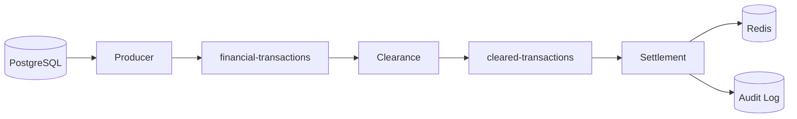

# 🏦 Real-Time Financial Transaction Pipeline

> **Event-driven financial processing system using Kafka, PostgreSQL, and Redis**

## 🏗️ Architecture



## ✨ Key Features

| Feature | Description |
|---------|-------------|
| 🚀 **Real-time Processing** | Sub-second transaction latency |
| 🎯 **Risk-based Validation** | Automated scoring and clearance rules |
| 💰 **Balance Management** | Atomic updates with before/after tracking |
| 📊 **Complete Audit Trail** | Full transaction lifecycle logging |
| ❌ **Rejection Handling** | Separate processing for failed transactions |
| 🖥️ **Web Dashboards** | PostgreSQL, Redis, and Kafka UIs |

## 🔧 System Components

### **Database Producer** → Enriches & Publishes
- Monitors PostgreSQL for new transactions
- Joins customer/account data for enrichment
- Calculates risk scores and publishes to Kafka

### **Clearance Consumer** → Validates & Routes
- Balance verification and risk assessment
- Business rule validation
- Routes to settlement or rejection

### **Settlement Consumer** → Executes & Stores
- Atomic balance updates
- Redis storage for fast lookups
- Comprehensive audit logging

## 🚀 Quick Start

### **Prerequisites**
- Docker Desktop
- Python 3.8+

### **1. Setup & Start Services**
```bash
# Clone and install dependencies
git clone <repository-url>
cd kafka-financial-poc
pip install -r requirements.txt

# Start infrastructure (wait 60 seconds)
cd docker && docker-compose up -d
```

### **2. Run Pipeline (3 terminals)**
```bash
# Terminal 1: Database Producer
python src/db_producer.py

# Terminal 2: Clearance Consumer  
python src/clearance_consumer.py

# Terminal 3: Settlement Consumer
python src/settlement_consumer.py
```

### **3. Access Dashboards**
| Service | URL | Credentials |
|---------|-----|-------------|
| PostgreSQL | http://localhost:8080 | admin@admin.com / admin |
| Redis | http://localhost:8081 | - |
| Kafka | http://localhost:8082 | - |

## 🧪 Testing

### **Add Test Transaction**
```bash
docker exec -it docker-postgres-1 psql -U user -d financial_db -c "
INSERT INTO transactions (transaction_id, amount, from_account, to_account, transaction_type, description) 
VALUES ('TEST001', 1500.00, 'ACC001', 'ACC002', 'TRANSFER', 'Test transaction');
"
```

### **Monitor Results**
- **Terminals**: Real-time processing logs
- **PostgreSQL**: Transaction status & audit trail  
- **Redis**: Settlement data with balance tracking
- **Kafka**: Message flow through topics

## 📊 Data Flow

### ✅ **Successful Transaction**
```
INSERT → Producer (enrich) → Clearance (approve) → Settlement (execute) → Redis
```

### ❌ **Rejected Transaction**  
```
INSERT → Producer (enrich) → Clearance (reject) → Settlement (log) → Redis
```

## ⚙️ Business Rules

### **Risk Scoring**
| Condition | Points |
|-----------|--------|
| Amount > $10K | +30 |
| Amount > $5K | +15 |
| Customer HIGH risk | +40 |
| Customer MEDIUM risk | +20 |

### **Clearance Logic**
| Risk Score | Action |
|------------|--------|
| > 70 | Manual review |
| 40-70 | Cleared with conditions |
| < 40 | Auto-cleared |
| Amount > $100K | Manual review |

## 💾 Redis Storage

```bash
# Settled transactions
settlement:{transaction_id} → {status, balances, customer_info...}

# Rejected transactions  
rejected:{transaction_id} → {reason, risk_score, available_balance...}
```

## 🔍 Monitoring

### **Service Health**
```bash
docker-compose ps                    # Check container status
docker-compose logs <service>        # View service logs
```

### **Database Queries**
```sql
-- Recent transactions
SELECT transaction_id, status, amount FROM transactions ORDER BY created_at DESC LIMIT 10;

-- Audit trail
SELECT * FROM transaction_audit ORDER BY changed_at DESC LIMIT 10;

-- Account balances
SELECT account_number, balance FROM accounts;
```

### **Redis Queries**
```bash
# View settlements
docker exec -it docker-redis-1 redis-cli KEYS "settlement:*"

# View rejections
docker exec -it docker-redis-1 redis-cli KEYS "rejected:*"

# Specific transaction
docker exec -it docker-redis-1 redis-cli HGETALL settlement:TXN001
```

## 🚀 Production Considerations

- **Scaling**: Add Kafka partitions for parallel processing
- **High Availability**: Redis clustering, database replicas
- **Security**: Input validation, audit trails, balance verification
- **Performance**: Connection pooling, memory monitoring

## 📄 License
MIT License